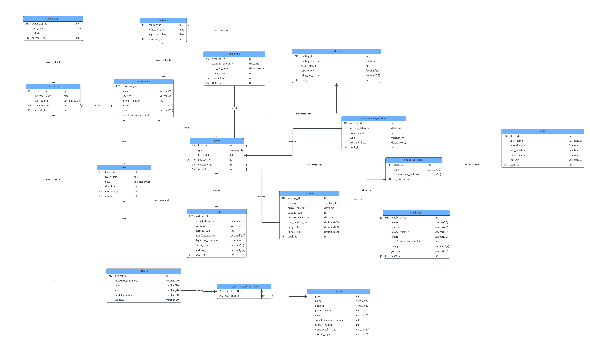

## AirMan-Database-System  
This repository contains the design and implementation of the AirMan System for managing airport operations at London Biggin Hill Airport. It includes an ERD diagram, SQL scripts for database creation and data population.  

### Background  
London Biggin Hill Airport has been publicly owned by the London Borough of Bromley since 1974. The airport operates as a public-private partnership, with Biggin Hill Airport Ltd. managing it on a commercial basis since 1994. It specializes in general aviation, serving private aircraft, business jets, and non-commercial flights.

In 2016, the airport gained a boost in commercial potential when Bombardier relocated its European operations there. Additionally, in 2018, funding for the London Aerospace & Technology College and plans for an airport hotel were secured.

Currently, the airport’s operations rely on siloed, outdated systems. To improve efficiency, the CEO commissioned a project to replace these fragmented systems with a unified, modular design. The project aims to streamline core services, including customer parking, security, ground transport, aircraft maintenance, and charter services.

The project involves the development of a new system, with the first module, AirMan, being developed by AirSoft, an Irish software company.

### Project Approach  
**Step 1: Creating the ERD Diagram**  
The first step was to identify the key entities and their attributes based on the project requirements. The ERD provides a visual representation of the database schema, showing how different entities are related to each other.   

**Step 2: Implementing the Database in MySQL Workbench**  
With the ERD as a blueprint, the next step was to implement the database schema in MySQL Workbench. This involved creating tables for each entity and defining their relationships.  

[Database Creation SQL Script](AirMan_script_file.sql)  

Example Snippet:  
-- CREATE TABLE IF NOT EXISTS customers (  
customer_id INT UNSIGNED NOT NULL AUTO_INCREMENT,  
name VARCHAR(20) NOT NULL DEFAULT '',  
address VARCHAR(20) NOT NULL DEFAULT '',  
phone_number INT UNSIGNED,  
email VARCHAR(20) NOT NULL DEFAULT '',  
type VARCHAR(20) NOT NULL DEFAULT '', 
social_insurance_number INT UNSIGNED NOT NULL DEFAULT 0,  
PRIMARY KEY (customer_id)  
);

**Step 3: Inserting Data**  
Mock data was inserted into the tables to demonstrate the system's functionality. This data serves as sample records to test and validate the database operations.
